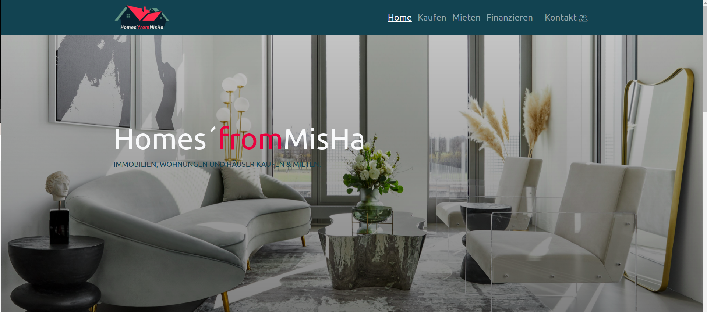

# Immobilienmakler Frontend 

#  ~ Homes´fromMisHa ~

## Information über Projekt:

- Das ist eine Immiboilienmakler-Website.
- Das ist meine erste Projekt mit Bootstrap.
- Es besteht aus 4 Seite.
- Komponente: Startseite, Mietenseite, Kaufenseite, Kontaktseite.
- Das Projekt ist Responsive-Design.
- Logodesign gehört mir.

### Projektstart : 18.01.2022
### Projektabschluss : 20.01.2022

--------------------------------------------------------------

### .[Link von meiner Seite]( https://sevdeorscelik.github.io/Homes-fromMisHa/)

### Reference Images :

 